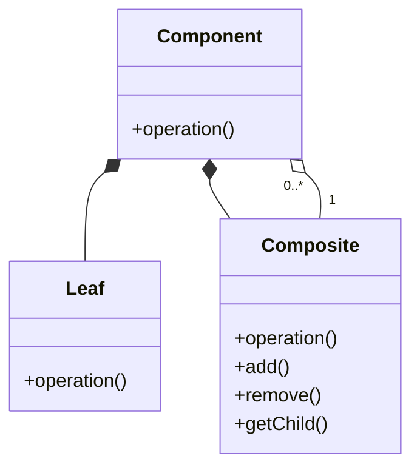

# example-design-pattern

Exemplo do Design Pattern Composite em Python como atividade para a disciplina de Engenharia de Software

```mermaid
classDiagram
class Component{
+operation()
}
class Leaf{
+operation()
}
class Composite{
+operation()
+add()
+remove()
+getChild()
}
Component *-- Leaf
Component *-- Composite
Component "0..*" o-- "1" Composite
```
